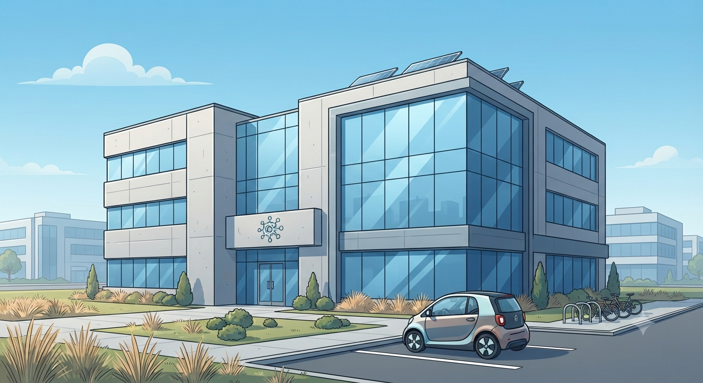
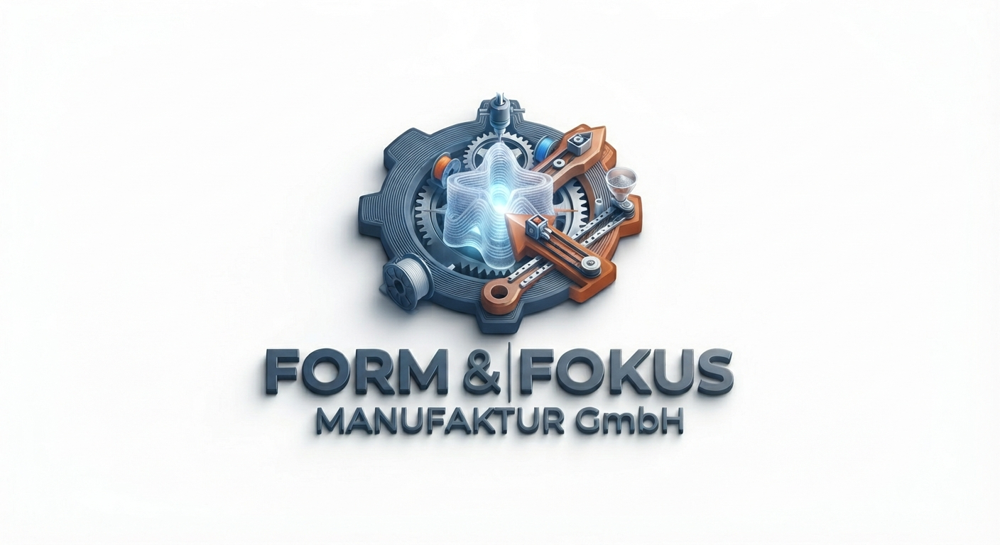

# Kapitel 1: Vorstellung des Modellunternehmens

In diesem Kapitel ...

- ... wird das Modellunternehmen, für das Sie im Lernfeld 7 arbeiten, vorgestellt.

## Form & Fokus Manufaktor GmbH kennenlernen

Die Form & Fokus Manufaktur GmbH verbindet modernes Digitalhandwerk mit persönlichem Kundenservice. Das fünfköpfige Team kombiniert dabei kreatives Design mit moderner Fertigungstechnik. Während ein Teil der Mitarbeiter sich um Verwaltung und Einkauf kümmert, liegt der Schwerpunkt im Betrieb auf der computergestützten Konstruktion (CAD) sowie der Produktion mit 3D-Druckern und Lasercuttern.

Das Geschäftsmodell ruht auf drei Säulen: Dem schnellen Verkauf von dekorativen Standardartikeln, der Fertigung individueller Kundenwünsche und der Nachkonstruktion spezieller Bauteile. Eine wichtige Nische hat sich das Unternehmen bei Ersatzteilen für Oldtimer erarbeitet. Wenn Originalteile nicht mehr existieren, werden sie mittels Reverse Engineering – also dem Vermessen und Nachkonstruieren – digitalisiert und neu produziert. Das erfordert eine genaue Dokumentation aller Schritte und Fahrzeugtypen, um die Daten für spätere Besteller dauerhaft zu sichern.

Der Verkauf läuft über zwei Wege: Ein Onlineshop wickelt das überregionale Geschäft mit automatisierten Zahlungen und Versand ab. Ergänzend dazu gibt es einen lokalen Straßenladen für spontane Einkäufe vor Ort. Diese Kombination stellt hohe Anforderungen an die Lagerhaltung. Materialbestände wie 3D-Druck-Filamente oder Holz- und Acrylplatten müssen ständig überwacht und mit den laufenden Aufträgen sowie der Maschinenauslastung abgeglichen werden. Jeder Auftrag durchläuft dabei feste Phasen von der ersten Skizze über die Fertigung bis zur Qualitätskontrolle. Für die Kunden ist es dabei besonders wichtig, jederzeit den aktuellen Status ihrer Bestellung zu kennen.

Um das Wachstum zu bewältigen, wurde eine neue Stelle für die digitale Transformation geschaffen. Bisher arbeiten die verschiedenen Software-Programme – wie der Onlineshop, die CAD-Tools und die Lagerlisten – noch getrennt voneinander als isolierte Einzel-Lösungen. Aufgabe der neuen Fachkraft ist es, diese Systeme miteinander zu vernetzen. Das Herzstück bildet dabei der Aufbau einer zentralen Unternehmensdatenbank. Sie soll verhindern, dass Daten doppelt erfasst werden (Redundanzen), und allen Bereichen eine einheitliche, verlässliche Informationsquelle bieten.

## Zusätzliches Material, weitere Übungen & Tipps

**Zusatzmaterial**

