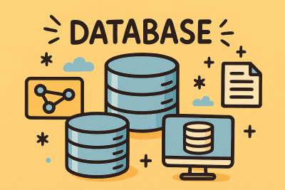

# Kapitel 2: Grundlagen der Datenhaltung in Anwendungen



In diesem Kapitel werden Sie ...

- ... die Datenhaltung in Anwendungen planen.
- ... relationale und nicht-relationale Datenbanken unterscheiden.
- ... Fehler in relationalen Datenbanken durch gute Planung vermeiden.

---

## Handlungssituation

Die Form & Fokus Manufaktur GmbH plant im Rahmen ihrer digitalen Transformation den Aufbau einer zukunftsfähigen Dateninfrastruktur. Bisher existieren Insel-Lösungen: Der Onlineshop speichert Bestelldaten, die Konstruktion legt CAD-Dateien und Dokumentationen auf lokalen Laufwerken ab, und die Lagerhaltung erfolgt teilweise manuell.


---

## Kompetenz 2.0: Datenhaltung in Anwendungen planen

Um die Geschäftsprozesse effizient miteinander zu verknüpfen, soll ein neues System entstehen. Dabei steht das Entwicklerteam vor der Frage, wie die sehr unterschiedlichen Datenstrukturen im Unternehmen am besten gespeichert werden. Es stehen relationale Datenbanken (SQL) und nicht-relationale Datenbanken (NoSQL) zur Auswahl.


---

### Arbeitsauftrag A|2.0: Daten für Anwendungen bereitstellen

#### Aufgabe 1

Führen Sie stichpunktartig vier Bereiche auf, in denen die Form & Fokus Manufaktur Daten abspeichert und verwendet.

#### Aufgabe 2

Vergleichen Sie die Eignung einer relationalen SQL-Datenbank mit einer NoSQL-Datenbank für die Form & Fokus Manufaktur. Informieren Sie sich dazu mithilfe des Informationsmaterial über die Arten der Datenbanken (M|2.0.0: Arten von Datenbanken) sowie über das ACID-Prinzip (M|2.0.1: ACID-Eigenschaften).

##### Aufgabenteil a

Für welche der identifizierten Datenarten ist eine SQL-Datenbank besonders gut geeignet? Begründen Sie Ihre Wahl.

##### Aufgabenteil b

Für welche Datenarten bietet eine NoSQL-Lösung klare Vorteile? Begründen Sie.

#### Aufgabe 3

Zu welcher Art der Datenhaltung würden Sie der Form & Fokus Manufaktur raten?

---

### Informationsmaterial M|2.0.0: Arten von Datenbanken

In der modernen Softwareentwicklung gibt es nicht „die eine“ Datenbank für alle Einsatzzwecke. Je nachdem, wie Daten strukturiert sind und wie schnell oder flexibel darauf zugegriffen werden muss, unterscheidet man grundlegend zwischen **relationalen Datenbanken (SQL)** und **nicht-relationalen Datenbanken (NoSQL)**.

**Relationale Datenbanken (SQL)**

Relational bedeutet, dass Daten in **festen, zweidimensionalen Tabellen** mit Spalten und Zeilen organisiert sind. Die Tabellen werden über Schlüssel (Primär- und Fremdschlüssel) logisch miteinander verknüpft. Zur Abfrage und Manipulation der Daten wird die standardisierte Sprache **SQL** (Structured Query Language) genutzt.

* **Hauptmerkmale:**
* **Strenges Schema:** Die Struktur der Tabellen (welche Spalten existieren) muss vor dem Speichern exakt definiert sein.
* **Hohe Datenkonsistenz (ACID):** Transaktionen werden garantiert fehlerfrei ausgeführt. Das System stellt sicher, dass Daten niemals widersprüchlich werden.
* **Redundanzfrei:** Durch Normalisierung werden doppelte Daten vermieden.


* **Typische Vertreter:** MySQL, MariaDB, PostgreSQL, Microsoft SQL Server, Oracle.
* **Beispiel aus der Form & Fokus Manufaktur:** Kundenverwaltung, Rechnungsstellung, Auftragsabwicklung und Lagerbestände (überall dort, wo exakte, strukturierte Daten und finanzielle Korrektheit entscheidend sind).

**Nicht-relationale Datenbanken (NoSQL)**

NoSQL steht für *„Not Only SQL“*. Diese Datenbanken verzichten bewusst auf starre Tabellenschemata und komplexe Tabellenverknüpfungen. Stattdessen speichern sie Daten in flexiblen Formaten wie **Dokumenten (z. B. JSON)**, Key-Value-Paaren, Graphen oder Spaltenfamilien.

* **Hauptmerkmale:**
* **Schema-Freiheit (Flexibilität):** Jeder Datensatz kann eine völlig unterschiedliche Struktur oder unterschiedliche Felder besitzen, ohne dass vorher Tabellen angepasst werden müssen.
* **Hohe Skalierbarkeit & Geschwindigkeit:** Sie lassen sich sehr einfach auf viele Server verteilen und bieten extrem schnelle Lese- und Schreibzugriffe bei riesigen Datenmengen.
* **Eventual Consistency:** Zugunsten von Geschwindigkeit und Verfügbarkeit wird die absolute Konsistenz der Daten oft minimal verzögert.


* **Typische Vertreter:** MongoDB (Dokumenten-Store), Redis (Key-Value-Store), Neo4j (Graph-Datenbank).
* **Beispiel aus der Form & Fokus Manufaktur:** Speicherung von komplexen 3D-Drucker-Logdateien, Ablage von CAD-Metadaten zu Oldtimer-Teilen oder Produktbewertungen im Onlineshop.

---

### Informationsmaterial M|2.0.1: ACID-Eigenschaften

Damit in einer Datenbank bei gleichzeitigen Zugriffen oder Systemabstürzen keine Daten verloren gehen oder fehlerhaft werden, müssen Transaktionen zuverlässig abgewickelt werden. Eine **Transaktion** ist eine Folge von Datenbankoperationen (z. B. Buchen, Ändern, Löschen), die als **eine einzige unteilbare Einheit** ausgeführt wird.

Das **ACID-Prinzip** beschreibt die vier Grundanforderungen, die ein relationales Datenbankmanagementsystem (DBMS) erfüllen muss, um höchste Datenkonsistenz und Zuverlässigkeit zu garantieren.

**A – Atomicity (Atomarität / Unteilbarkeit)**

> **Grundsatz:** *Ganz oder gar nicht.*

Eine Transaktion besteht oft aus mehreren Einzelschritten. Atomarität garantiert, dass entweder **alle** Schritte einer Transaktion erfolgreich ausgeführt werden oder **gar kein** Schritt. Bricht eine Transaktion auf halbem Weg ab (z. B. durch einen Stromausfall), wird der Ursprungszustand vollständig wiederhergestellt (**Rollback**).

* **Beispiel aus der Form & Fokus Manufaktur:**
Ein Kunde kauft im Straßenladen ein vorgefertigtes Bauteil. Die Transaktion besteht aus zwei Schritten: 1. *Lagerbestand um 1 verringern* und 2. *Kassenbestand um 25,00 € erhöhen*. Bricht das System nach Schritt 1 ab, macht das DBMS die Lageränderung rückgängig. Es gibt keine "halben" Buchungen.

**C – Consistency (Konsistenz / Datenkonsistenz)**

> **Grundsatz:** *Regeln werden niemals verletzt.*

Eine Transaktion führt die Datenbank von einem gültigen Zustand in einen **anderen gültigen Zustand** über. Alle definierten Regeln (z. B. Primärschlüssel-Eindeutigkeit, Fremdschlüssel-Beziehungen oder Datentypen) müssen vor und nach der Transaktion eingehalten werden. Wäre das Ergebnis einer Transaktion ungültig, wird sie abgebrochen.

* **Beispiel aus der Form & Fokus Manufaktur:**
In der Datenbank ist geregelt, dass der Lagerbestand eines Materials nicht negativ sein darf (`Bestand >= 0`). Versucht eine Transaktion, 5 Rollen Filament abzubuchen, obwohl nur noch 2 auf Lager sind, lehnt das DBMS die Transaktion ab.

**I – Isolation (Isolierung / Entkopplung)**

> **Grundsatz:** *Gleichzeitige Zugriffe stören sich nicht.*

Greifen mehrere Benutzer oder Prozesse gleichzeitig auf die Datenbank zu, sorgt die Isolation dafür, dass sich die Transaktionen **nicht gegenseitig beeinflussen**. Jede Transaktion wird so ausgeführt, als wäre sie die einzige auf dem System. Unfertige Zwischenstände einer Transaktion sind für andere Benutzer unsichtbar.

* **Beispiel aus der Form & Fokus Manufaktur:**
Der Onlineshop und ein Mitarbeiter im Straßenladen greifen exakt im selben Moment auf die letzte Rolle *PLA Schwarz* zu. Durch die Isolierung verarbeitet das DBMS die Anfragen nacheinander (z. B. durch temporäre Sperren). So wird verhindert, dass beide Kunden dieselbe letzte Rolle kaufen.

**D – Durability (Dauerhaftigkeit / Beständigkeit)**

> **Grundsatz:** *Einmal gespeichert, bleibt gespeichert.*

Sobald eine Transaktion erfolgreich abgeschlossen ist (sog. **Commit**), sind die Daten **dauerhaft und unverlierbar** in der Datenbank gespeichert. Selbst ein unmittelbarer Systemabsturz oder ein Stromausfall direkt nach der Bestätigung darf nicht dazu führen, dass diese Daten verloren gehen.

* **Beispiel aus der Form & Fokus Manufaktur:**
Eine Oldtimer-Rekonstruktion wurde erfolgreich als erledigt im System verbucht und die Bestätigung angezeigt. Fällt eine Sekunde später der Strom im Gebäude aus, ist der geänderte Status nach dem Neustart des Servers garantiert noch genau so vorhanden.

**Das ACID-Prinzip im Überblick**

| Buchstabe | Begriff | Bedeutung | Praxis-Folge bei Fehlen |
| --- | --- | --- | --- |
| **A** | **Atomarität** | Transaktion ist unteilbar (ganz oder gar nicht). | Unvollständige Buchungen (z. B. Geld abgebucht, aber Ware nicht reserviert). |
| **C** | **Konsistenz** | Datenbankregeln bleiben immer gültig. | Ungültige oder unlogische Daten (z. B. negative Lagerbestände). |
| **I** | **Isolation** | Parallele Transaktionen beeinflussen sich nicht. | Doppelverkäufe oder falsche Zwischenwerte bei Mehrfachzugriff. |
| **D** | **Dauerhaftigkeit** | Erfolgreiche Datenänderungen bleiben dauerhaft erhalten. | Datenverlust bei Abstürzen direkt nach der Eingabe. |

---

## Kompetenz 2.1: Relationale Datenbank-Systeme beschreiben

Bei der Form & Fokus Manufaktur GmbH stehen die Zeichen auf Veränderung. Der Inhaber hat erkannt: Die bisherige Praxis, Daten verstreut in Excel-Tabellen, Textdateien und den internen Speichern einzelner Maschinen abzulegen, stößt an ihre Grenzen.

Besonders deutlich wird das Problem im Alltag:

- Ein Kunde ruft an und fragt nach dem Status seiner Oldtimer-Rekonstruktion. Der Kundenservice muss erst in der Werkstatt nachfragen, weil der aktuelle Fortschritt nur auf dem Werkstatt-PC notiert ist.
- Ein Bauteil muss nachproduziert werden. Das dazugehörige CAD-Modell ist zwar gespeichert, aber die Information, für welchen exakten Fahrzeugtyp und mit welchem Filamend-Material der Erstdruck erfolgreich war, liegt in einer separaten Tabelle auf dem Rechner der Konstruktion.
- Im Lager wird Material für einen Großauftrag reserviert, der Onlineshop weiß davon aber nichts und verkauft die letzten Holzplatten zeitgleich an einen Online-Kunden.

Um diese Ineffizienzen zu beenden, fordert die Geschäftsleitung einen klaren Schnitt: Sämtliche Kernprozesse sollen über ein relationales Datenbank-System (RDBMS) zentralisiert werden. Sie werden damit beauftragt, die Grundlagen für diese Umstellung zu erarbeiten und dem Team zu vermitteln.


---

### Arbeitsauftrag A|2.1: Der Weg zur relationalen Datenbank

#### Aufgabe 1

Arbeiten Sie heraus, welche generellen Vorteile ein hoher Digitalisierungsgrad und eine systematische, zentrale Datenhaltung für die Abläufe der Manufaktur bringen.

#### Aufgabe 2

Informieren Sie sich über die Komponenten eines Datenbanksystems (M|2.1.0: Datenbanksysteme) und erläutern Sie das Zusammenspiel dieser drei Komponenten anhand eines konkreten Szenarios aus der Manufaktur:

- Datenbank (DB)
- Datenbankmanagementsystem (DBMS)
- Datenbanksystem (DBS)

#### Aufgabe 3

Stellen Sie die Funktionsweise einer relationalen Datenbank (SQL) vereinfacht dar (Stichworte: Tabellen, Zeilen/Datensätze, Spalten/Attribute, Primär- und Fremdschlüssel). Nutzen Sie hierfür das Informationsmaterial M|2.1.1: Funktionsweise einer relationalen Datenbank (SQL).

#### Aufgabe 4

Beschreiben Sie anhand konkreter Beispiele aus der Manufaktur, welche Kernvorteile eine relationale Datenbank gegenüber Dateilisten hat. Nutzen Sie M|2.1.2: Vorteile zentraler Datenbanklösungen für einen Überblick.

#### Aufgabe 5

Identifizieren Sie drei Unternehmensbereiche der Form & Fokus Manufaktur, für die ein relationales Datenbank-System die ideale Wahl ist.

Begründen Sie für jeden Bereich kurz, warum die Daten hier eine feste, strukturierte Form haben und wie die Tabellen logisch miteinander verknüpft sein könnten.

---

### Informationsmaterial M|2.1.0: Datenbanksysteme

Wer im Alltag von einer "Datenbank" spricht, meint meist das Gesamtsystem. Fachlich unterscheidet man in der Informationstechnik jedoch genau zwischen drei Begriffen: der **Datenbank (DB)**, dem **Datenbankmanagementsystem (DBMS)** und dem **Datenbanksystem (DBS)**.

**1. Die Datenbank (DB) – Die eigentliche Datensammlung**

Eine **Datenbank** ist die strukturierte Sammlung von Daten, die logisch zusammengehören. Sie liegt in digitaler Form auf einem Speichermedium (z. B. einer Festplatte oder SSD).

*Die Datenbank ist wie ein moderner **Karteikasten**, in dem alle Kärtchen ordentlich einsortiert sind. Ohne jemanden, der darin liest oder schreibt, sind die Daten dort aber erst einmal nur "ruhende Informationen".*

**2. Das Datenbankmanagementsystem (DBMS) – Die intelligente Software**

Das **DBMS** ist die Software, die die Datenbank verwaltet. Es ist die Steuerungseinheit zwischen den Anwenderprogrammen (z.B. dem Onlineshop oder der CAD-Software) und den eigentlichen Daten auf der Festplatte.

Das DBMS erfüllt wichtige Aufgaben:

* **Daten speichern und abrufen:** Es nimmt Anfragen entgegen und liefert die passenden Daten zurück.
* **Zugriffsrechte verwalten:** Es sichert ab, wer Daten sehen oder verändern darf (Sicherheit).
* **Datenintegrität schützen:** Es sorgt dafür, dass keine fehlerhaften oder unvollständigen Daten gespeichert werden.
* **Mehrbenutzerbetrieb regeln:** Es verhindert Konflikte, wenn mehrere Personen gleichzeitig auf dieselben Daten zugreifen.

*Das DBMS ist wie der **Bibliothekar**. Er weiß exakt, wo welches Buch steht, achtet darauf, dass niemand Bücher beschädigt, regelt, wer welche Bücher ausleihen darf, und heftet neue Seiten an der richtigen Stelle ein.*

**3. Das Datenbanksystem (DBS) – Das Gesamtsystem**

Das **Datenbanksystem** ist der Oberbegriff für das Zusammenspiel aus beiden Komponenten: **DBS = DB + DBMS**.

Ein Datenbanksystem umfasst also sowohl die gespeicherten Daten (DB) als auch die Software, die diese Daten verwaltet (DBMS).

*Das Datenbanksystem ist die **gesamte Bibliothek** – inklusive des Gebäudes, aller Bücher (DB) und des Personals (DBMS), das den Laden am Laufen hält.*

**Das Zusammenspiel in der Praxis**

Wie arbeiten diese drei Komponenten zusammen, wenn bei *Form & Fokus* ein Auftrag bearbeitet wird?

```
[Anwendung: Shop / Kasse]
           │
           ▼ (1. SQL-Anfrage: "Gib mir den Lagerbestand von Filament Rot")
┌────────────────────────────────────────────────────────┐
│ DATENBANKSYSTEM (DBS)                                  │
│                                                        │
│  ┌──────────────────────────────────────────────────┐  │
│  │  Datenbankmanagementsystem (DBMS)                │  │
│  │  - Prüft Berechtigung                            │  │
│  │  - Verarbeitet die Anfrage                       │  │
│  └────────────────────────┬─────────────────────────┘  │
│                           │                            │
│                           ▼ (2. Liest Datenfeld)       │
│  ┌──────────────────────────────────────────────────┐  │
│  │  Datenbank (DB)                                  │  │
│  │  [Tabellen auf der Festplatte]                   │  │
│  └──────────────────────────────────────────────────┘  │
└────────────────────────────────────────────────────────┘

```

1. **Der Impuls:** Der Kundenservice schaut im System nach, ob genügend rotes PLA-Filament für ein Oldtimer-Ersatzteil auf Lager ist.
2. **Die Aufgabe des DBMS:** Das DBMS schaltet sich dazwischen. Es prüft, ob der Mitarbeiter das Recht hat, Lagerbestände abzufragen, übersetzt die Anfrage und sucht gezielt in der Datenbank.
3. **Der Zugriff auf die DB:** Das DBMS liest den Wert aus der entsprechenden Tabelle der Datenbank ab und sendet das Ergebnis ("12 Rollen verfügbar") zurück an den Bildschirm des Mitarbeiters.

---

### Informationsmaterial M|2.1.1: Grundbegriffe der relationalen Datenbank

Das **relationale Datenbankmodell** ist die am weitesten verbreitete Form der strukturierten Datenhaltung. Die Grundidee ist einfach: Alle Daten werden in zweidimensionalen **Tabellen** (technisch: *Relationen*) organisiert, die über gemeinsame Datenfelder logisch miteinander verknüpft werden.

**1. Tabelle (Relation)**

Eine Tabelle fasst gleichartige Datenobjekte zusammen (z. B. alle Kunden oder alle Materialbestände). Sie besteht aus Zeilen und Spalten.

**2. Datensatz (Zeile / Tupel)**

Eine Zeile in einer Tabelle repräsentiert ein **einzelnes, konkretes Objekt**.

* *Beispiel:* Eine Zeile in der Kunden-Tabelle enthält die vollständigen Daten von *einem* bestimmten Kunden.

**3. Attribut (Spalte / Feld)**

Eine Spalte beschreibt eine **Eigenschaft**, die alle Datensätze dieser Tabelle gemeinsam haben.

* *Beispiel:* Die Spalten `Vorname`, `Nachname`, `E-Mail` und `Ort` in der Kunden-Tabelle.

**4. Attributwert (Datenfeld / Wert)**

Der konkrete Inhalt in der Zelle einer Spalte für einen bestimmten Datensatz.

* *Beispiel:* Der Attributwert `"Filament PLA rot"` in der Spalte `Materialbezeichnung`.

**5. Primärschlüssel (Primary Key - PK)**

Ein Attribut (oder eine Kombination mehrerer Attribute), das jeden Datensatz innerhalb einer Tabelle **eindeutig identifiziert**. Ein Primärschlüssel darf niemals doppelt vorkommen und niemals leer (`NULL`) sein.

* *Beispiel:* Die `Kunden_ID` stellt sicher, dass zwei Kunden mit demselben Namen (z. B. "Max Mustermann") eindeutig unterschieden werden können.

**6. Fremdschlüssel (Foreign Key - FK)**

Ein Attribut in einer Tabelle, das auf den **Primärschlüssel einer anderen Tabelle** verweist. Dadurch entsteht die logische Verknüpfung (Relation) zwischen zwei Tabellen.

* *Beispiel:* In der Tabelle `Bestellungen` steht die `Kunden_ID` als Fremdschlüssel. So ist klar, welcher Kunde welche Bestellung aufgegeben hat, ohne dass alle Kundendaten in der Bestellung doppelt getippt werden müssen.

**Beispiel aus der Form & Fokus Manufaktur**

Tabelle **`Kunde`**

| Kunden_ID (PK) | Nachname | Ort |
| --- | --- | --- |
| **101** | Neumann | Hannover |
| **102** | Weber | Hamburg |

Tabelle **`Bestellung`**

| Bestell_ID (PK) | Datum | Kunden_ID (FK) |
| --- | --- | --- |
| 5001 | 12.10.2026 | **101** |
| 5002 | 13.10.2026 | **101** |
| 5003 | 14.10.2026 | **102** |

Der Fremdschlüssel `Kunden_ID` in der Tabelle *Bestellung* verweist direkt auf den Primärschlüssel `Kunden_ID` der Tabelle *Kunde*. So sieht man sofort, dass Kunde Neumann (ID 101) zwei Bestellungen getätigt hat.

---

### Informationsmaterial M|2.1.2: Vorteile zentraler Datenbanklösungen

Eine relationale Datenbank bietet im Vergleich zu Dateilisten oder analoger Datenhaltung zahlreiche Vorteile:

- Zentralisierung: Alle Daten befinden sich an einem Ort und sind über einheitliche Schnittstellen abrufbar.
- Mehrbenutzerzugriff: Mehrere Personen können gleichzeitig auf die Daten zugreifen, ohne Datenverlust.
- Datensicherheit: Berechtigungskonzepte sorgen dafür, dass nur autorisierte Personen auf bestimmte Daten zugreifen können.
- Vermeidung von Redundanzen: Daten werden einmalig gespeichert und mehrfach nutzbar gemacht.
- Konsistenz: Durch Regeln (z. B. Beziehungen, Pflichtfelder) wird sichergestellt, dass Daten vollständig und korrekt sind.
- Automatisierung: Prozesse wie die Rechnungserstellung oder das Einpflegen von Aufträgen können automatisiert werden.
- Skalierbarkeit: Datenbanken wachsen problemlos mit dem Unternehmen mit.
- Anbindung von Software: Moderne Anwendungen greifen direkt auf Datenbanken zu, z. B. Werkstattplaner, CRM-Tools oder Buchhaltungssoftware.

---

## Kompetenz 2.2: Fehler in relationalen Datenbanken vermeiden

Bei der manuellen Erfassung der Oldtimer-Bauteile und Kundenadressen kommt es im Alltag der Manufaktur immer wieder zu Problemen: Kundennamen sind unterschiedlich geschrieben, beim Löschen einer Bestellung verschwindet plötzlich die gesamte Kundenadresse und Materialpreise müssen an mehreren Stellen gleichzeitig geändert werden. Um dieses Datenchaos dauerhaft zu verhindern, soll die geplante SQL-Datenbank so strukturiert werden, dass solche Fehler durch eine saubere Normalisierung von vornherein ausgeschlossen sind.


---

### Arbeitsauftrag A|2.2: Fehler erkennen und bei der Planung vermeiden

#### Ausgangslage

In der Form & Fokus Manufaktur GmbH wurde vorübergehend versucht, alle Kunden- und Auftragsdaten in einer einzigen, großen unnormalisierten Tabelle zu verwalten. Das führt im Betriebsalltag regelmäßig zu Missverständnissen und Fehlern.

Hier ein Ausschnitt aus der aktuellen Tabelle **`Auftragsübersicht`**:

| Kunde | Ort | Bauteile | Material (Preis/kg) |
| :--- | :--- | :--- | :--- |
| Klaus Müller | Hannover | Schalterknopf VW T3, Abdeckung Porsche 911 | PLA Schwarz (25,00 €), PETG Transparent (30,00 €) |
| Sarah Schmidt | Hamburg | Zierleiste MB W123 | ABS Grau (35,00 €) |
| Tom Becker | Bremen | Halterung BMW E30, Clip Audi 80 | PETG Transparent (30,00 €), PLA Schwarz (25,00 €) |

#### Aufgabe 1

Betrachten Sie die Beispieltabelle `Auftragsübersicht` und nutzen Sie das Informationsmaterial M|2.2.0: Fehlerbeschreibungen in relationalen Datenbanken.

1. Erklären Sie in eigenen Worten den Begriff Redundanz.
2. Identifizieren Sie konkrete Datenfelder in der Tabelle, die mehrfach doppelt abgespeichert sind, und beschreiben Sie, warum diese Datenhaltung uneffizient ist.

#### Aufgabe 2

Durch die unsaubere Tabellenstruktur entstehen im Alltag gefährliche Datenfehler (sogenannte Anomalien). Analysieren Sie folgende drei Praxis-Szenarien aus der Manufaktur und ordnen Sie ihnen den passenden Fachbegriff zu:

* **Szenario A:** Der Lieferant hebt den Preis für das Material *PLA Schwarz* von 25,00 € auf 28,00 € an. Ein Mitarbeiter passt den Preis an, vergisst aber dies bei einem Fall.
* *Welche Anomalie liegt hier vor? Beschreiben Sie die Auswirkung auf die Datenkonsistenz.*

* **Szenario B:** Ein neuer Kunde möchte sich registrieren lassen, hat aber noch keinen konkreten Auftrag erteilt. Die Datenbank verlangt jedoch zwingend eine `Auftrags_ID` für jeden neuen Datensatz.
* *Welche Anomalie verhindert die Erfassung des Neukunden? Begründen Sie.*

* **Szenario C:** Der Kunde *Becker, Tom* storniert seinen einzigen Auftrag. Der Datensatz wird aus der Tabelle gelöscht.
* *Welches unbeabsichtigte Problem entsteht durch das Löschen dieser Zeile? Welche Anomalie tritt hier auf?*

#### Aufgabe 3

Um diese Anomalien dauerhaft zu beseitigen, muss die unstrukturierte Tabelle schrittweise in ein sauberes relationales Modell überführt werden (Normalisierung). Nutzen Sie zu Ihrer Information das M|2.2.1: Normalisierung von Datenbanken.

1. Erste Normalform (1. NF): Erläutern Sie die Bedingung der *Atomarität* am Beispiel der Spalte `Kunde_Name`. Wie muss diese Spalte aufgeteilt werden?
2. Zweite & Dritte Normalform (2. & 3. NF): Zerschlagen Sie die fehleranfällige Gesamttabelle in drei separate, sinnvolle Tabellen.
* Legen Sie für jede Tabelle die passenden Attribute fest.
* Bestimmen Sie jeweils den Primärschlüssel (PK).
* Verknüpfen Sie die Tabellen mithilfe von Fremdschlüsseln (FK) logisch miteinander.

---

### Informationsmaterial M|2.2.0: Fehlerbeschreibungen in relationalen Datenbanken

Wandern Daten unstrukturiert oder doppelt in eine Datenbank, führt das schnell zu Fehlern. Man spricht hierbei von **Redundanzen**, **inkonsistenten Daten** und **Anomalien**. Eine saubere Datenbankstruktur verhindert solche Probleme, bevor sie im Betriebsalltag den Ablauf stören.

**1. Redundanz (Mehrfacherspeicherung)**

Unter Redundanz versteht man das **mehrfache Speichern derselben Information** an unterschiedlichen Stellen. Das verschwendet nicht nur Speicherplatz, sondern ist vor allem die Hauptursache für fehlerhafte Daten im System.

* *Beispiel:* Die Adresse eines Kunden steht sowohl in der Kundenliste als auch in jeder einzelnen Bestellung, die er jemals aufgegeben hat.

**2. Inkonsistente Daten (Widersprüchlichkeit)**

Inkonsistenz beschreibt einen Zustand, in dem **Daten widersprüchlich, veraltet oder unvollständig** sind. Daten sind konsistent, wenn sie sachlich richtig und eindeutig sind. Entstehen durch doppelterfasste Daten unterschiedliche Werte für denselben Sachverhalt, ist die Datenhaltung inkonsistent – das System verliert seine Verlässlichkeit.

* *Beispiel:* Im System existiert Kunde Klaus Müller einmal mit dem Wohnort `"Hannover"` und an anderer Stelle mit dem Wohnort `"Wolfsburg"`. Welche Angabe für den Paketversand korrekt ist, lässt sich nicht mehr zweifelsfrei feststellen.

**3. Änderungsanomalie (Update-Anomalie)**

Eine Änderungsanomalie tritt auf, wenn redundante Daten geändert werden müssen, dies aber **nicht an allen Stellen gleichzeitig** geschieht. Die Daten werden dadurch direkt **inkonsistent**.

* *Beispiel:* Ein Lieferant erhöht den Preis für das Material `"PLA Schwarz"`. Der neue Preis wird in der Tabelle für einen aktuellen Auftrag angepasst, bei älteren Aufträgen in derselben Tabelle bleibt der alte Preis stehen. Es ist nicht mehr klar, welcher Preis aktuell gilt.

**4. Einfügeanomalie (Insert-Anomalie)**

Eine Einfügeanomalie liegt vor, wenn ein neuer Datensatz **nicht eingegeben werden kann**, weil benötigte Pflichtdaten aus anderen Bereichen noch fehlen.

* *Beispiel:* Ein Neukunde möchte sich im System registrieren. Da die unsaubere Tabelle aber zwingend eine `Auftrags_ID` als Hauptmerkmal verlangt, kann der Kunde erst angelegt werden, sobald er auch tatsächlich etwas kostenpflichtig bestellt.

**5. Löschanomalie (Delete-Anomalie)**

Eine Löschanomalie entsteht, wenn durch das Löschen eines Datensatzes **unbeabsichtigt wichtige Zusatzinformationen verloren gehen**, die eigentlich noch benötigt werden.

* *Beispiel:* Ein Kunde storniert seinen einzigen Auftrag. Wird die entsprechende Auftragszeile aus der Tabelle gelöscht, verschwinden gleichzeitig auch die komplette Kundenadresse und die Stammdaten des bestellten Oldtimer-Bauteils aus dem System.

**Beispiel aus der Form & Fokus Manufaktur**

Fehleranfällige Tabelle **`Auftragsübersicht`**

| Auftrags_ID (PK) | Kunde_Name | Kunde_Ort | Material | Material_Preis_Pro_KG |
| --- | --- | --- | --- | --- |
| **1001** | Müller, Klaus | Hannover | PLA Schwarz | **25,00 €** |
| **1002** | Schmidt, Sarah | Hamburg | ABS Grau | 35,00 € |
| **1003** | Müller, Klaus | Hannover | PLA Schwarz | **28,00 €** |

In dieser unsauberen Struktur tritt eine **Änderungsanomalie** offen zutage: Bei Auftrag `1003` wurde der Preis für `"PLA Schwarz"` auf 28,00 € geändert, bei Auftrag `1001` steht jedoch noch der alte Preis von 25,00 €. Die Datenbank enthält an dieser Stelle **inkonsistente Daten**, da für denselben Artikel zwei unterschiedliche Preise existieren. Zudem liegt eine **Redundanz** vor, da Name und Ort von Herrn Müller doppelt gespeichert sind.

---

### Informationsmaterial M|2.2.1: Normalisierung von Datenbanken

Die **Normalisierung** ist ein schrittweises Verfahren zur Gestaltung von Datenbanken. Ziel ist es, **Redundanzen** abzubauen, **Anomalien** zu vermeiden und **inkonsistente Daten** im System zu verhindern. Dabei wird eine unstrukturierte Tabelle schrittweise in mehrere, sauber miteinander verknüpfte Tabellen aufgeteilt.

**Unnormalisierte Ausgangslage (0. Normalform)**

Eine Tabelle befindet sich in der **0. Normalform (0. NF)**, wenn Daten unstrukturiert erfasst sind, Datenfelder mehrere Werte gleichzeitig enthalten oder Wiederholungsgruppen existieren. Es existiert noch kein eindeutiger Primärschlüssel.

Tabelle **`Auftrag_Unstrukturiert`**

| Kunde | Ort | Bauteile | Material | Material_Preis_Pro_KG |
| --- | --- | --- | --- | --- |
| Klaus Müller | Hannover | Schalterknopf T3, Abdeckung P911 | PLA Schwarz | 25,00 € |
| Sarah Schmidt | Hamburg | Zierleiste MB W123 | ABS Grau | 35,00 € |

**1. Erste Normalform (1. NF) – Atomarität**

> **Merksatz 1. NF:**
> Jedes Feld enthält nur einen einzigen Wert (atomar) und es gibt keine Wiederholungsgruppen. Erst hier wird ein eindeutiger Primärschlüssel definiert.

Eine Tabelle ist in der **Ersten Normalform**, wenn alle Attributwerte **atomar** (nicht weiter teilbar) sind. Mehrfachnennungen in einer Zelle (wie Kommalisten) werden aufgelöst. Zusammengesetzte Datenfelder (wie vollständige Namen) werden in einzelne Spalten zerlegt.

**Schritte zur 1. NF:**

1. Spalte `Kunde` in `Vorname` und `Nachname` aufteilen.
2. Mehrfachnennungen in der Spalte `Bauteile` auf einzelne Datensätze aufteilen.
3. **Eindeutigen Primärschlüssel festlegen:** Da die `Auftrags_ID` durch die Aufteilung nun mehrfach vorkommt (z. B. `1001`), reicht sie alleine nicht mehr als Schlüssel aus. Es wird ein **zusammengesetzter Primärschlüssel** aus (`Auftrags_ID` + `Bauteil_ID`) gebildet.

Tabelle **`Auftrag_1NF`**

| Auftrags_ID (PK) | Bauteil_ID (PK) | Vorname | Nachname | Ort | Bauteil_Bezeichnung | Material | Material_Preis_Pro_KG |
| --- | --- | --- | --- | --- | --- | --- | --- |
| **1001** | **B-01** | Klaus | Müller | Hannover | Schalterknopf T3 | PLA Schwarz | 25,00 € |
| **1001** | **B-02** | Klaus | Müller | Hannover | Abdeckung P911 | PLA Schwarz | 25,00 € |
| **1002** | **B-03** | Sarah | Schmidt | Hamburg | Zierleiste MB W123 | ABS Grau | 35,00 € |

**2. Zweite Normalform (2. NF) – Vollständige funktionale Abhängigkeit**

> **Merksatz 2. NF:**
> Die Tabelle ist in der 1. NF und jedes Nicht-Schlüssel-Attribut hängt vollständig vom NEBENEINANDER aller Teile des Primärschlüssels ab.

Die **Zweite Normalform** betrifft Tabellen mit einem **zusammengesetzten Primärschlüssel**. Jedes Attribut, das nur von einem *Teil* des Schlüssels abhängt, wird in eine eigene Tabelle ausgelagert.

**Analyse unseres Beispiels:**

* `Vorname`, `Nachname` und `Ort` hängen nur von der `Auftrags_ID` ab (nicht von der `Bauteil_ID`).
* `Bauteil_Bezeichnung`, `Material` und `Material_Preis_Pro_KG` hängen von der `Bauteil_ID` ab.

**Schritte zur 2. NF:** Aufteilung in zwei getrennte Tabellen.

Tabelle **`Auftrag`**

| Auftrags_ID (PK) | Vorname | Nachname | Ort |
| --- | --- | --- | --- |
| **1001** | Klaus | Müller | Hannover |
| **1002** | Sarah | Schmidt | Hamburg |

Tabelle **`Bauteil`**

| Bauteil_ID (PK) | Auftrags_ID (FK) | Bauteil_Bezeichnung | Material | Material_Preis_Pro_KG |
| --- | --- | --- | --- | --- |
| **B-01** | 1001 | Schalterknopf T3 | PLA Schwarz | 25,00 € |
| **B-02** | 1001 | Abdeckung P911 | PLA Schwarz | 25,00 € |
| **B-03** | 1002 | Zierleiste MB W123 | ABS Grau | 35,00 € |

**3. Dritte Normalform (3. NF) – Keine transitiven Abhängigkeiten**

> **Merksatz 3. NF:**
> Die Tabelle ist in der 2. NF und kein Nicht-Schlüssel-Attribut hängt von einem ANDEREN Nicht-Schlüssel-Attribut ab.

Eine Tabelle ist in der **Dritten Normalform**, wenn keine **transitiv** (indirekt) abhängigen Attribute enthalten sind. Wenn Attribut A von Attribut B abhängt und Attribut B vom Primärschlüssel abhängt, muss Attribut B samt seinen Abhängigkeiten in eine neue Tabelle ausgelagert werden.

**Analyse unseres Beispiels:**

* In der Tabelle `Bauteil` hängt `Material_Preis_Pro_KG` nicht direkt von der `Bauteil_ID` ab, sondern vom `Material` (`PLA Schwarz` kostet immer 25,00 €). Ändert sich das Material, ändert sich der Preis.

**Schritte zur 3. NF:** Auslagern des Materials in eine eigene Material-Tabelle.

**Das finale Datenmodell in der 3. Normalform (3. NF)**

Tabelle **`Auftrag`**

| Auftrags_ID (PK) | Vorname | Nachname | Ort |
| --- | --- | --- | --- |
| **1001** | Klaus | Müller | Hannover |
| **1002** | Sarah | Schmidt | Hamburg |

Tabelle **`Bauteil`**

| Bauteil_ID (PK) | Auftrags_ID (FK) | Material_ID (FK) | Bauteil_Bezeichnung |
| --- | --- | --- | --- |
| **B-01** | 1001 | **M-01** | Schalterknopf T3 |
| **B-02** | 1001 | **M-01** | Abdeckung P911 |
| **B-03** | 1002 | **M-02** | Zierleiste MB W123 |

Tabelle **`Material`**

| Material_ID (PK) | Material_Bezeichnung | Preis_Pro_KG |
| --- | --- | --- |
| **M-01** | PLA Schwarz | 25,00 € |
| **M-02** | ABS Grau | 35,00 € |

**Ergebnis:** Die Daten sind nun frei von Redundanzen. Ändert sich beispielsweise der Preis für `PLA Schwarz`, muss dieser Wert in der Tabelle **`Material`** exakt an *einer einzigen Stelle* angepasst werden. **Änderungs-, Einfüge- und Löschanomalien sowie inkonsistente Daten sind damit vollständig ausgeschlossen.**

