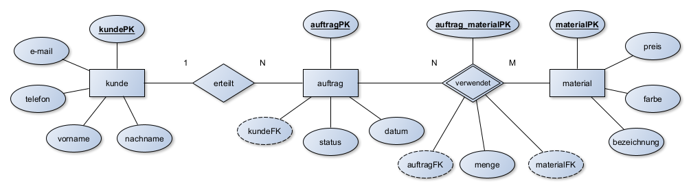
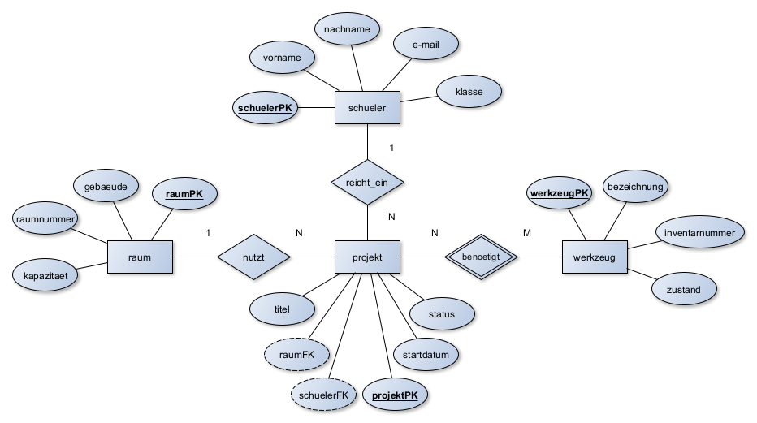
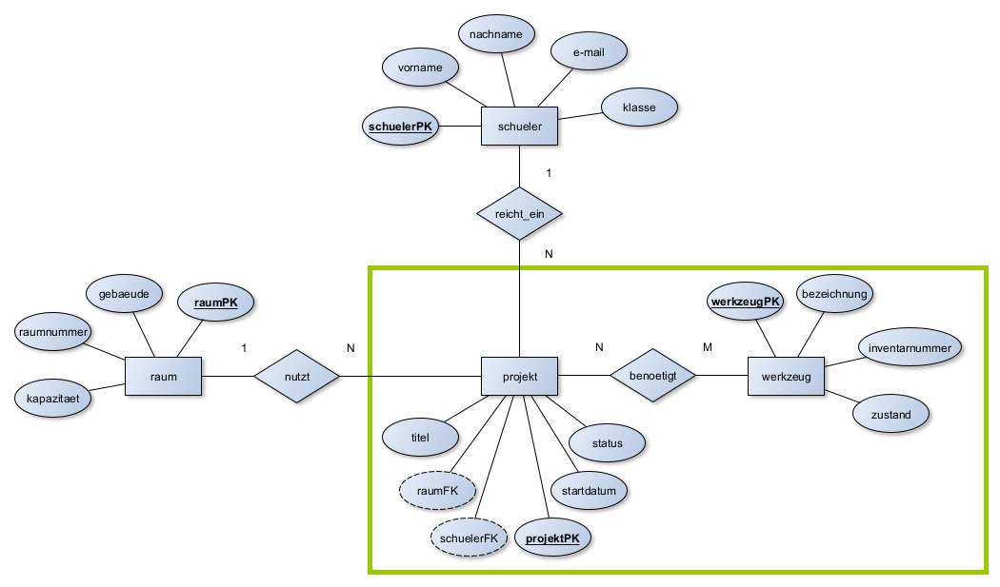
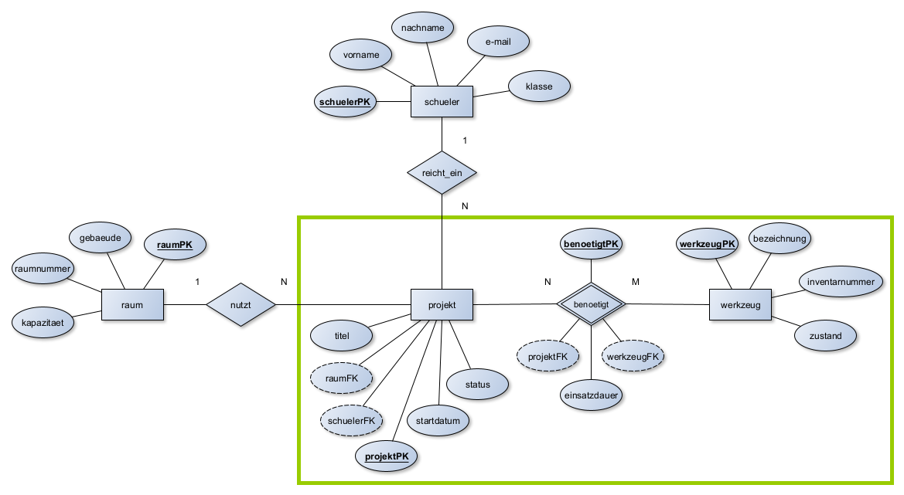
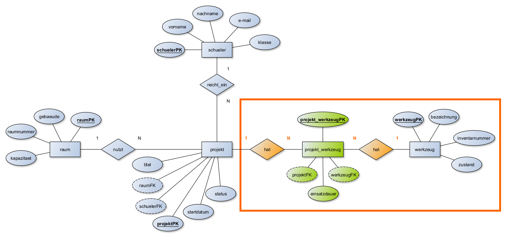
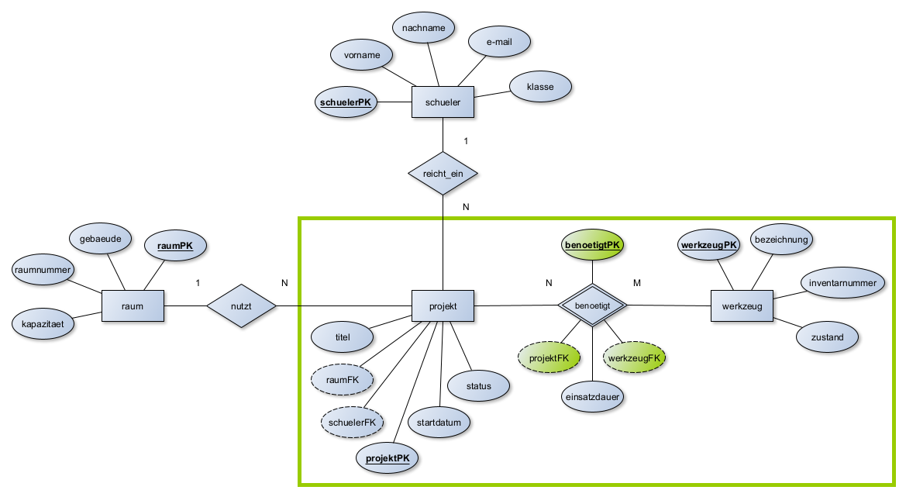
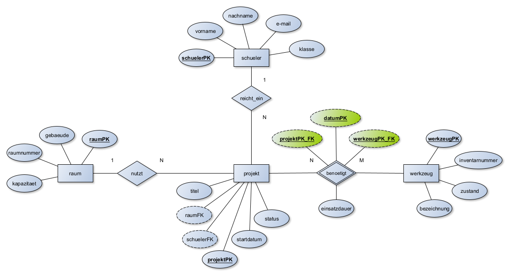
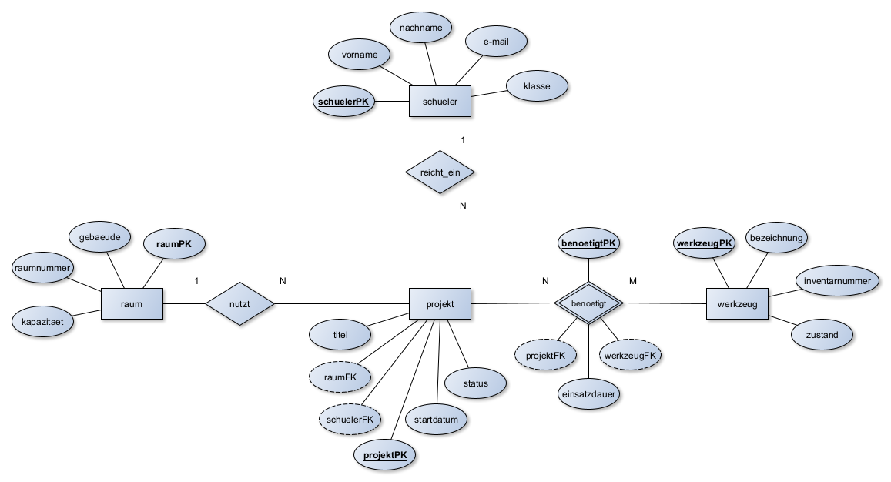
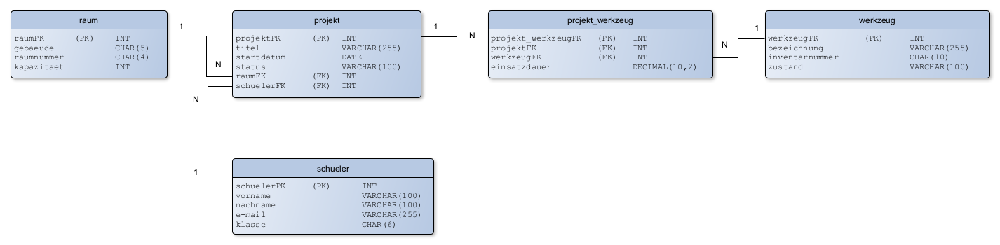

# Kapitel 3: Datenbanken modellieren

In diesem Kapitel werden Sie ...

- ... Entity-Relationship-Diagramme beschreiben, vervollständigen und erstellen.
- ...  ER-Diagramme in das Relationale Datenbankschema überführen.
- ... alle Schritte durchführen, die notwendig sind, um anschließend eine Datenbank anzulegen.

---

## Handlungssituation

Die Form & Fokus Manufaktur GmbH verzeichnet eine stark steigende Nachfrage nach individuell 3D-gedruckten Ersatzteilen und gelaserten Dekoartikeln. Bisher führt das 5-köpfige Team Kundenaufträge und den Materialbestand in unübersichtlichen Tabellendokumenten. Dies führt zu Engpässen beim Filamentlager und verlorenen Auftragsdetails.

Als IT-Nachwuchskräfte erhalten Sie den Auftrag, eine strukturierte, relationale Datenbanklösung zu konzipieren, die zunächst die Kunden- und Auftragsverwaltung sowie die Material- und Lagerhaltung integriert.

 <figure style="max-width: 100%; margin: 1em 0; text-align: center;">
  <figcaption style="font-size: 0.85em; color: #555555; margin-top: 6px; font-style: italic;"> Abb.: Chaos in der Form & Fokus Manufaktur GmbH (🤖 KI-generiert)</figcaption></figure> 

---

## Kompetenz 3.0: ER-Diagramme beschreiben

Die Geschäftsführung hat von einem befreundeten externen Berater einen ersten Skizzenentwurf für die Kunden- und Auftragsverwaltung erhalten. Sie sollen sich einen Überblick verschaffen.

 <figure style="max-width: 100%; margin: 1em 0; text-align: center;"> 
 	  
 	 <figcaption style="font-size: 0.85em; color: #555555; margin-top: 6px; font-style: italic;"> 
 	 	 Abb.: Entwurf eines Entity-Relationship-Diagramms (🤖 KI-generiert) 
 	 </figcaption> 
 </figure> 

---

### Arbeitsauftrag A|3.0: Elemente des ER-Diagramms beschreiben

Ihnen liegt das folgende ER-Diagramm vor:

#### Aufgabe 1

Beschreiben Sie anhand des Ausschnitts (Kunde → erteilt → Auftrag) die Grundelemente eines ER-Diagramms:

- Entität
- Attribut
- Beziehung
- Primärschlüssel
- Fremdschlüssel
 
#### Aufgabe 2

Erläutern Sie dem Team der Manufaktur in eigenen Worten, warum Attribute wie kundePK oder auftragPK als Primärschlüssel gewählt werden müssen.

---

### Material M|3.0.0: Das Entity-Relationship-Diagram

#### Grundlagen & Software

Das Entity-Relationship-Modell, kurz **ERM**, ist ein einfaches Modell für den Entwurf von Datenbanken. Die deutsche Übersetzung des Begriffes lautet in etwa: *Gegenstand-Beziehung-Modell*. Es wird auch Entity-Relationship-Diagramm (ERD) genannt.

Hier ein Beispiel, das ein **System zur Verwaltung von Schulprojekten** abbildet:

Ein erster Entwurf kann entweder handschriftlich oder mit einem Computerprogramm erfolgen. Einige Softwarevorschläge sind bspw.:

* **yEd - Graph Editor** - yWorks (für Einsteiger & Fortgeschrittene; erfüllt die im Unterricht verwendete Notation voll)
* **MySQL Workbench** (tendenziell eher für Fortgeschrittene; erfüllt die im Unterricht verwendete Notation teilweise)

> **Hinweis:** Sie müssen hinsichtlich der IHK-Prüfungen und Klausuren unbedingt in der Lage sein, ER-Diagramme auch auf Papier zu zeichnen. Das mag zwar etwas komisch klingen, aber der Schwierigkeitsgrad ist aufgrund mangelnder Verschiebemöglichkeiten bedeutend höher und sollte zwingend ebenfalls geübt werden.

Bei dem Aufbau eines ER-Modells bzw. des daraus resultierenden ER-Diagrammes sind unterschiedliche Darstellungsformen in Gebrauch. Die bekannteste Form stellt die sogenannte **Chen-Notation** von *Peter Chen* dar. Chen gilt als Entwickler der ER-Diagramme. Die grundlegenden Elemente werden im Folgenden erklärt.

#### Beschreibung des ERM

In diesem Entity-Relationship-Modell (ERM) wird ein vereinfachtes System zur **Organisation von Schülerprojekten an einer Schule** dargestellt. Es umfasst vier zentrale Entitäten: `schueler`, `projekt`, `raum` und `werkzeug`. Die Beziehungen zwischen diesen Entitäten sind klar definiert und durch Primär- und Fremdschlüssel abgebildet.

Die Entität **`schueler`** besitzt das Primärattribut `schuelerPK` und steht in einer 1:N-Beziehung mit der Entität **`projekt`**, dargestellt durch die Beziehung **`reicht_ein`**. Das bedeutet, dass ein Schüler mehrere Projekte einreichen bzw. leiten kann, ein Projekt jedoch genau einem verantwortlichen Schüler zugeordnet ist. Die Beziehung wird technisch durch den Fremdschlüssel `schuelerFK` in der Entität `projekt` realisiert.

Die Entität **`projekt`** stellt das zentrale Bindeglied des Modells dar. Sie besitzt ein Primärattribut `projektPK` und ist mit mehreren weiteren Entitäten verknüpft. Jeder Projektaufbau findet in genau einem Raum statt, was durch die $N:1$-Beziehung **`nutzt`** zur Entität **`raum`** dargestellt wird. In der Entität `projekt` ist dafür der Fremdschlüssel `raumFK` hinterlegt. Die Entität `raum` selbst verfügt über das Primärattribut `raumPK`.

Weiterhin steht die Entität **`projekt`** in einer N:M-Beziehung zur Entität **`werkzeug`**, modelliert über die Beziehung **`benoetigt`**. Dies bedeutet, dass ein Projekt mehrere Werkzeuge/Geräte verwenden kann und gleichzeitig ein Werkzeug in mehreren Projekten zum Einsatz kommen kann. Diese Beziehung wird über eine eigene Beziehungstabelle **`benoetigt`** abgebildet, die das Primärattribut `benoetigtPK` sowie die beiden Fremdschlüssel `projektFK` und `werkzeugFK` enthält. Die Entität **`werkzeug`** besitzt das Primärattribut `werkzeugPK`.

Durch diese Modellierung lassen sich realistische Abläufe im Schulalltag abbilden: Ein Schüler kann beliebig viele Projekte anmelden. Jedes dieser Projekte ist fest einem bestimmten Raum zugewiesen und wird unter Verwendung verschiedener Werkzeuge ausgeführt. Dabei können Werkzeuge mehrfach und in unterschiedlichen Projekten verwendet werden.

Das ERM enthält neben den Entitäten und Beziehungen inkl. ihrer Kardinalitäten auch die Schlüsselattribute (PK & FK). Die einfachen Attribute werden oftmals zugunsten der Übersicht des ERM im ersten Schritt weggelassen.

#### Beschreibung der Elemente eines ERM

##### Entität (Entity)

* Als Entität wird ein eindeutig bestimmbares Objekt bezeichnet. Über dieses Objekt sollen Informationen (Attribute) gespeichert oder verarbeitet werden.
* Eine Entität wird im ER-Diagramm als **Rechteck** dargestellt und grundsätzlich im **Singular** beschrieben.
* Im Beispiel sind `schueler`, `projekt`, `werkzeug` und `raum` die Entitäten.

##### Attribut (Attribute)

* Ein Attribut ist ein Merkmal bzw. Kennzeichen eines Objektes, also einer Entität. Jede Entität kann beliebig viele Attribute besitzen. Das Wort Attribut lässt sich auch als Eigenschaft bezeichnen.
* Ein Attribut wird im ER-Diagramm als **Ellipse** dargestellt. Die Attribute werden mit ungerichteten Kanten zu den Entitäten verbunden.
* Während z.B. das Attribut `bezeichnung` eine Eigenschaft der Entität `werkzeug` darstellt, sind *"Akkuschrauber"* oder *"Lötkolben"* konkrete Attributwerte, die in dem Attribut gespeichert sein können. In ER-Diagrammen werden stets nur **Attribute** und keine Attributwerte benutzt.
* Im Beispiel sind:
* `vorname`, `nachname`, `e-mail`, `klasse` (alle in `schueler`)
* `titel`, `startdatum`, `status` (in `projekt`)
* `gebaeude`, `raumnummer`, `kapazitaet` (alle in `raum`)
* `einsatzdauer` (in `benoetigt`)
* `bezeichnung`, `inventarnummer`, `zustand` (in `werkzeug`)
die einfachen Attribute.

##### Primärschlüssel-Attribut (Primary Key)

* Ein Primärschlüssel wird verwendet, um einen Datensatz eindeutig zu identifizieren. Ein Schlüsselfeld bedient sich dabei eines Attributs.
* Ein Schlüsselfeld wird durch ein Attribut (Ellipse) dargestellt. Der Text ist dabei im Gegensatz zu weiteren Attributen **unterstrichen**. Nach LF7-Konvention wird der Primärschlüssel genau so benannt wie seine Entität und erhält die Großbuchstaben **PK** angehängt.
* Im Beispiel sind `schuelerPK`, `raumPK`, `projektPK`, `benoetigtPK`, `werkzeugPK` die Primärschlüssel-Attribute.

##### Fremdschlüssel-Attribut (Foreign Key)

* Der Fremdschlüssel ist ein Attribut, welches sich auf den Primärschlüssel einer anderen Entität bezieht (er referenziert den Primärschlüssel). Durch den Fremdschlüssel kann eine Beziehung zwischen zwei Tabellen erst wirklich realisiert werden.
* Im LF7 wird der Name des Fremdschlüssels so gebildet, dass der Primärschlüssel, auf den er sich bezieht, aufgegriffen wird. Statt **PK** wird aber **FK** angehängt (sowie im ERD gestrichelt umrandet dargestellt).
* Im Beispiel sind:
* `schuelerFK` (in Bezug auf den `schuelerPK` der Entität `schueler`)
* `raumFK` (in Bezug auf den `raumPK` der Entität `raum`)
* `projektFK` (in Bezug auf den `projektPK` der Entität `projekt`)
* `werkzeugFK` (in Bezug auf den `werkzeugPK` der Entität `werkzeug`)
die Fremdschlüssel-Attribute.

##### Beziehung (Relationship)

* Als Beziehung oder Relation bezeichnet man die Verbindung zwischen zwei Entitäten. Durch die Nutzung von Beziehungen sollen im Datenbankentwurf Sachverhalte zwischen zwei Objekten dargestellt werden.
* Eine Beziehung wird im ER-Diagramm als **Raute** dargestellt. Diese verbindet mit Linien zwei Entitäten.
* In dem Beispiel sind `reicht_ein`, `nutzt` und `benoetigt` die Beziehungen. Hieraus wird auch die LF7-Konvention deutlich: Das Wort *"hat"* passt zwar fast immer, es sollte aber ein möglichst treffendes **Verb** benutzt werden.

##### Kardinalitäten (Cardinalities)

In Datenbanken beschreiben Kardinalitäten die Anzahl der möglichen Beziehungen zwischen Datensätzen in zwei Tabellen.

* **1:1 (eins zu eins):** Ein Datensatz in Tabelle A ist mit höchstens einem Datensatz in Tabelle B verknüpft – und umgekehrt.
* **1:N (eins zu viele):** Ein Datensatz in Tabelle A kann mit mehreren Datensätzen in Tabelle B verknüpft sein, aber ein Datensatz in Tabelle B gehört nur zu einem Datensatz in Tabelle A.
* **N:M (viele zu viele):** Mehrere Datensätze in Tabelle A können mit mehreren Datensätzen in Tabelle B verknüpft sein. Diese Beziehung wird meist über eine Zwischentabelle (Relationstabelle / Beziehungsentität) realisiert.

**Anwendung im Beispiel:**

1. Zwischen `schueler` und `projekt` besteht eine **1:N-Beziehung**: Es kann je Projekt immer nur einen hauptverantwortlichen Schüler geben, ein Schüler kann aber mehrere Projekte im Laufe der Schulzeit einreichen.
2. `projekt` und `raum` stehen ebenfalls in einer **1:N-Beziehung** (bzw. N:1 aus Sicht des Projekts), da ein Projekt fest in genau einem Raum aufgebaut wird. Ein Raum kann aber nacheinander oder modular für mehrere Projekte zugewiesen werden.
3. Zwischen `projekt` und `werkzeug` besteht eine **N:M-Beziehung**. Bei einem Projekt können verschiedene Werkzeuge zum Einsatz kommen (bspw. Akkuschrauber und Lötkolben), aber andererseits kann ein bestimmtes Werkzeug auch in mehreren Projekten nacheinander eingesetzt werden. Die Einsatzdauer wird dabei direkt an der Beziehung `benoetigt` festgehalten.

---

### Material M|3.0.1: Modellierung von Datenbanken - Erstellung eines ERM (YouTube Herr-NM - 25 Min. Videotutorial)

<iframe width="1200" height="675" src="https://www.youtube-nocookie.com/embed/y3B8NLg9Orc?si=K2bZ6NWq5A3XmbdS" title="YouTube video player" frameborder="0" allow="accelerometer; autoplay; clipboard-write; encrypted-media; gyroscope; picture-in-picture; web-share" referrerpolicy="strict-origin-when-cross-origin" allowfullscreen></iframe>

--- 

### Arbeitsauftrag A|3.1: Beziehungstypen unterscheiden

Für die Auftragsabwicklung müssen die fachlichen Abhängigkeiten präzise geregelt sein. Ihnen liegt erneut das folgende ER-Diagramm vor:

#### Aufgabe 1

Unterscheiden Sie die Beziehungstypen 1:1, 1:N und N:M anhand folgender konkreter Fragen aus dem Manufaktur-Alltag:

- Wie viele Kunden können einen bestimmten Auftrag erteilen?
- Wie viele Aufträge kann ein Stammkunde im Laufe der Zeit aufgeben?
- Wie viele verschiedene Druck-Filamente/Materialien können in einem komplexen Auftrag verbaut werden, und in wie vielen Aufträgen kommt dasselbe Filament zum Einsatz?

#### Aufgabe 2

Ordnen Sie den Beispielen aus Aufgabe 1 die jeweiligen Kardinalitäten zu und begründen Sie Ihre Entscheidung.

#### Aufgabe 3

Erläutern Sie, warum im vorgegebenen ER-Diagramm der `kundeFK` an der Entität `Auftrag` steht.

#### Aufgabe 4

Erläutern Sie, warum zwischen der Entität `Auftrag` und der Entität `Material` die Schlüsselattribute an der Beziehung `verwendet` stehen.

---

### Material M|3.1.0: Auflösen der N:M-Beziehung

#### N:M-Beziehungen im ERM – Auflösung und Umsetzung

In einem Entity-Relationship-Modell (ERM) beschreibt eine **N:M-Beziehung** (Viele-zu-Viele) eine Verbindung, bei der ein Datensatz aus Entität A mit mehreren aus Entität B verknüpft sein kann – und umgekehrt.

#### Warum kann man N:M-Beziehungen nicht direkt umsetzen?

Relationale Datenbanksysteme erlauben keine direkte Speicherung von N:M-Beziehungen in einer einzigen Tabelle. Das liegt daran, dass:

* eine relationale Tabelle immer nur eindeutige Tupel (Zeilen) enthalten darf,
* Fremdschlüsselbeziehungen in relationalen Tabellen immer 1:1 oder 1:N sein müssen.

Daher muss jede N:M-Beziehung durch eine **Beziehungsentität** aufgelöst werden.

#### Beispiel: Projekt & Werkzeug in der Schulwerkstatt

Ein Schüler nutzt für ein Projekt in der Schulwerkstatt mehrere Werkzeuge/Geräte. Ein Werkzeug (z. B. ein Akkuschrauber) kann in vielen Projekten zum Einsatz kommen, und ein Projekt benötigt mehrere Werkzeuge. Das ist eine klassische N:M-Beziehung zwischen `projekt` und `werkzeug`.

Die Abbildung 1 ist bereits ein gültiges ERM, allerdings wird in Prüfungsaufgaben häufig die **"Auflösung der N:M-Beziehungen"** gefordert, welche in diesem ersten Schritt noch nicht durchgeführt wurde.

**Abbildung 1:** Noch nicht aufgelöste N:M-Beziehung (`projekt` → `benoetigt` → `werkzeug`)

#### Lösung: Einführung einer Beziehungsentität `benoetigt`

Wir modellieren in der Standardnotation:

1. **Entität:** `werkzeug`:

     - werkzeug(**werkzeugPK**, bezeichnung, zustand)

2. **Entität:** `projekt`:

     - projekt(projektPK, titel, status, *schuelerFK*)

3. **Beziehungsentität:** `benoetigt`

     - benoetigt(**benoetigtPK**, einsatzdauer, *projektFK*, *werkzeugFK*)

#### Die Beziehungsentität `benoetigt` enthält:

* einen **künstlichen Primärschlüssel** `benoetigtPK` (z. B. `"B0042"`)
* zwei **Fremdschlüssel** auf die beteiligten Entitäten (`projektFK`, `werkzeugFK`)
* **zusätzliche Informationen**, die nur die konkrete Beziehung betreffen, z. B. `einsatzdauer` (in Stunden/Tagen)

Damit ergibt sich folgendes ERM, welches die fertig aufgelöste N:M-Beziehung enthält (in der Chen-Notation dargestellt durch das doppelt umrandete Beziehungs-Rauten-Symbol mit eigenen Attributen). Dies wäre die korrekte Lösung, wenn die Auflösung der N:M-Beziehung gefordert ist.

**Abbildung 2:** Fertig aufgelöste N:M-Beziehung über die Beziehungsentität `benoetigt`

> **Achtung:** Die folgende Erläuterung dient nur dem Verständnis und zeigt die spätere technische Sicht.
> Die **Abbildung 3** verdeutlicht, was technisch aus der Beziehungsentität im späteren **Relationalen Datenbankschema** folgt: Die Auflösung der N:M-Beziehung erfolgt durch eine neue Tabelle in der Mitte, welche im relationalen Schema in zwei 1:N-Beziehungen überführt wird. Letztendlich steht das `projekt` mit der Zwischentabelle in Beziehung (1:N) und das `werkzeug` ebenfalls (1:N).

#### Warum ist die Beziehungsentität notwendig?

* **Technisch zwingend** in relationalen Datenbanken zur Realisierung von Datenstrukturen.
* **Ermöglicht Zusatzinformationen** (z. B. `einsatzdauer`, `ausleihedatum`, `geplante_stunden`), die weder rein zum Werkzeug noch rein zum Projekt gehören.
* **Saubere Modellierung** im Sinne der 3. Normalform.
* **Flexibel erweiterbar** bei zukünftigen Anforderungen im Schulbetrieb.

#### Künstlicher Primärschlüssel vs. Zusammengesetzter Primärschlüssel

> **Vorsicht IHK:** Die IHK verwendet in den Aufgabestellungen gerne statt des **künstlichen Primärschlüssels** (wie hier benoetigtPK bzw. projekt_werkzeugPK) einen zusammengesetzten Schlüssel. Hier wird dann ein Eintrag in der Beziehungsentität durch die Kombination zweier oder noch mehr Attributen eindeutig.

Ein **künstlicher Primärschlüssel** ist ein eigenständiges, fortlaufendes Feld (z. B. eine ID oder Auto-Increment-Zahl), das keinen fachlichen Bezug zu den Daten hat und nur zur technischen Eindeutigkeit existiert.

Ein **zusammengesetzter Primärschlüssel** besteht aus der Kombination mehrerer bereits vorhandener Attribute (häufig den beiden Fremdschlüsseln der beteiligten Entitäten). Damit eine Kombination wirklich eindeutig ist, werden je nach Fall ein oder mehrere weiter Attribute benötigt. Für das o.g. Beispiel könnte dies so aussehen:

Das Datum wird als dritter Schlüssel in der Kombination gebraucht, da ansonsten ein Werkzeug nur einmal in einem Projekt benutzt werden könnte. Hier ist es nun möglich dasselbe Werkzeug im Projekt an unterschiedlichen Tagen zu verwenden. Sollte eine noch feinere Nutzung abgebildet werden könnten Start- und End-Uhrzeit der Verwendung ebenfalls noch als Schlüssel hinzugezogen werden, sodass ein Werkzeug zwischen bspw. 8 und 10 Uhr sowie 15 und 16 Uhr am selben Tag verwendet werden könnte. Dieser Aufwand entfällt beim o.g. künstlichen Schlüssel.

---

## Kompetenz 3.1: ER-Diagramme vervollständigen und erstellen

Der Berater-Entwurf war unvollständig. Es fehlen Ansprechpartner, Lieferadressen und Auftragspositionen. Sie wollen das Modell entsprechend ergänzen.

<figure style="max-width: 100%; margin: 1em 0; text-align: center;"> 
 	  
 	 <figcaption style="font-size: 0.85em; color: #555555; margin-top: 6px; font-style: italic;"> 
 	 	 Abb.: Verwaltung der Kundendaten in der Form & Fokus Manufaktur GmbH (🤖 KI-generiert) 
 	 </figcaption> 
</figure> 

---

### Arbeitsauftrag A|3.2: Vervollständigung der Kunden- und Auftragsverwaltung

#### Aufgabe 1

Ergänzen Sie das vorgegebene ERM der Kunden- und Auftragsverwaltung um fehlende Attribute und Entitäten (E-Mail, Lieferanschrift des Kunden, Erstellungsdatum des Auftrags, Lieferstatus (offen, in Bearbeitung, zugestellt), Datum der Wunschfertigstellung). Beachten Sie dabei die 3. Normalform.

#### Aufgabe 2

Fügen Sie die benötigten Beziehungen ein und tragen Sie die korrekten Kardinalitäten an den Beziehungsrauten ein.

#### Aufgabe 3

Nach Abstimmung mit den anderen Mitarbeitenden der Form & Fokus Manufaktur stellen Sie fest, dass es immer wieder zu abweichenden Rechnungs- und Lieferanschriften kommt. Verändern Sie das ER-Diagramm so, dass die Unterscheidung ermöglicht wird. Beachten Sie dabei die 3. Normalform und das Auflösen von N:M-Beziehungen.

---

### Arbeitsauftrag A|3.3: Erstellung eines ER-Diagramms für die Material- und Lagerhaltung

Um Produktionsstopps bei den 3D-Druckern und Lasercuttern zu vermeiden, muss der Materialbestand (Filamentrollen z. B. PLA/PETG/ABS, Harze, Acrylplatten) und deren Lagerorte erfasst werden.

#### Aufgabe 1

Identifizieren Sie die relevanten Entitäten.

#### Aufgabe 2

Bestimmen Sie geeignete Attribute und Primärschlüssel.

#### Aufgabe 3

Zeichnen Sie ein eigenständiges ER-Diagramm für die Material- und Lagerhaltung inklusive aller Kardinalitäten. Berücksichtigen Sie die 3. Normalform, lösen Sie N:M-Beziehungen auf.

---

### Arbeitsauftrag A|3.4: Verknüpfung der beiden Datenmodelle

Ein Auftrag kann erst produziert werden, wenn das benötigte Material disponiert ist. Nun sollen Kundenauftrag und Materialwirtschaft zusammengeführt werden.

#### Aufgabe 1

Analysieren Sie die Schnittstelle zwischen der Kunden- und Auftragsverwaltung sowie der Material- und Lagerhaltung. An welcher Stelle sind die Daten sinnvoll miteinander zu verknüpfen.

#### Aufgabe 2

Verknüpfen Sie die ER-Diagramme aus A|3.2: Vervollständigung der Kunden- und Auftragsverwaltung und A|3.3: Erstellung eines ER-Diagramms für die Material- und Lagerhaltung zu einem Gesamtmodell. Berücksichtigen Sie die 3. Normalform, lösen Sie N:M-Beziehungen auf.

---

## Kompetenz 3.2: ER-Diagramm in das Relationale Datenbankschema überführen

Die Form & Fokus Manufaktur hat ihre Kunden, Aufträge und Materialien erfolgreich in einem ER-Diagramm modelliert. Doch beim Versuch, dieses visuelle Konzept direkt in eine relationale Datenbank einzupflegen, folgt die Ernüchterung.

Weder vielschichtige Beziehungen noch Kardinalitäten lassen sich eins zu eins in starre Tabellen übertragen. Der fachliche Entwurf der Manufaktur spricht schlicht eine andere Sprache als das technische Zielsystem. Wie schlagen wir nun die Brücke vom visuellen Modell zum funktionierenden relationalen Schema?

 <figure style="max-width: 100%; margin: 1em 0; text-align: center;"> 
 	  
 	 <figcaption style="font-size: 0.85em; color: #555555; margin-top: 6px; font-style: italic;"> 
 	 	 Abb.: Planung eines Relationalen Datenbankschemas (🤖 KI-generiert) 
 	 </figcaption> 
 </figure> 
 
---

### Arbeitsauftrag A|3.5: Relationales Datenbankschema vom ERM abgrenzen

Die Geschäftsführung versteht nicht, warum das grafische ER-Diagramm nicht direkt so als Tabelle in eine Datenbank eingespielt werden kann.

#### Aufgabe 1

Arbeiten Sie die strukturellen und konzeptionellen Unterschiede zwischen einem fachlich-konzeptionellen ER-Modell und einem technisch-implementierungsnahen Relationalen Datenbankschema heraus.

#### Aufgabe 2

Erläutern Sie insbesondere das Problem von N:M-Beziehungen in relationalen Datenbanken.

---

### Material M|3.5.0: Das relationale Datenbankschema

#### Relationales Datenbankmodell

Das Relationale Datenbankmodell ist das am weitverbreitetste Datenmodell, welches in der Datenbankentwicklung als Standard genutzt wird. Das Fundament des Datenbankmodells besteht aus vier Elementen: Tabellen, Attributen, Beziehungen und die Grundlagen der relationalen Algebra.

Sie stellt eine mathematische Beschreibung einer Tabelle und ihre Beziehung zu anderen möglichen Tabellen dar. Die Operationen auf diese Relationen werden durch die relationale Algebra bestimmt.

Des Weiteren ist die relationale Algebra auch die Grundlage für die Datenbanksprache SQL.

Auch wenn die mathematische Gewichtung und die Abstraktion der Daten in diesem Modell sehr stark ist, sind relationale Datenbankmodelle vergleichsweise sehr einfach und flexibel zu erstellen.

#### Eigenschaften vom Relationalen Datenbankmodell

Das relationale Datenbankmodell besteht aus drei wichtigen Bausteinen:

- Tabellen
- Attributen
- Beziehungen

Ein Relationales Datenbankmodell ist eine Ansammlung von Tabellen, die miteinander verknüpft sind. Jede Zeile (auch Tupel genannt) in einer Tabelle ist ein Datensatz. Jedes Tupel besteht aus einer großen Reihe von Eigenschaften (Attributen), den Spalten der Tabelle. Ein Relationsschema legt dabei die Anzahl und den (Daten-) Typ der Attribute für eine Tabelle fest.

Des Weiteren können Verknüpfungen (Beziehungen) über sogenannte Primärschlüssel hergestellt werden, um bestimme Attribute, die den gleichen Primärschlüssel oder in einer Detailtabelle als Fremdschlüssel besitzen, abzufragen.

#### Beispiel für ein Relationales Datenbankschema

Wir überführen das ERM aus dem Informationsmaterial M|3.1.0: Auflösen der N:M-Beziehung in das relationale Datenbankschema. Hier die Ausgangssituation:

Nach der Überführung in die Tabellen-Struktur für jede einzelne Entität sowie der Zuordnung von Schlüsselattributen und Datentypen sieht das fertige Schema wie folgt aus:

#### Hinweise:

- Die Beziehungen sind nun nur noch Kanten, keine Rauten mehr.
- Die Beziehungen verlassen eine Entität auf Höhe des Fremdschlüssels und zeigen auf die Höhe des dazugehörigen Primärschlüssels.
- Die N:M-Beziehung wurde gemäß Abbildung 3 im Informationsmaterial M|2.1.1: N:M-Beziehungen auflösen nun in 1:N-Beziehungen überführt.
- Die Datentypen bei Primär- und Fremdschlüssel müssen identisch sein,
- Der Primärschlüssel wird immer ganz oben angegeben.
- Die weiteren Attribute (auch die Fremschlüssel) kommen dann in der Reihenfolge, wie später die Tabelle von links nach rechts gelesen aufgebaut sein soll.
- Der Primärschlüssel kann auch in der Praxis als VARCHAR gewählt werden, damit der bregenzte Zahlenraum des INT kein Problem darstellt. Außerdem werden bspw. Kundennummern im Beispiel mit K001 angegeben, sind demnach keine reinen Zahlenwerte (und selbst wenn, dann würde man VARCHAR wählen, da mit Kundennummern nicht gerechnet werden muss).
- Der Datentyp DECIMAL(10,2) begrenzt den Einsatz auf eine Höhe von 99.999.999,99 Minuten.
- 
---

### Material M|3.5.1: Modellierung von Datenbanken - Erstellung eines relationalen Datenbankschemas (YouTube Herr-NM - 16 Min. Videotutorial)

<iframe width="1200" height="675" src="https://www.youtube-nocookie.com/embed/ufBd4Aj8ZSQ?si=WSZUAsw3UIkLOebb" title="YouTube video player" frameborder="0" allow="accelerometer; autoplay; clipboard-write; encrypted-media; gyroscope; picture-in-picture; web-share" referrerpolicy="strict-origin-when-cross-origin" allowfullscreen></iframe>

---

### Arbeitsauftrag A|3.6: Erstellung eines Relationalen Datenbankschemas

Überführen Sie das Gesamtergebnis aus A|3.4: Verknüpfung der beiden Datenmodelle in ein valides relationales Schemamodell.

#### Aufgabe 1

Notieren Sie sich als Zwischenschritt alle Entitäten und ihre Attribute als "Kurzschreibweise" in der Standardnotation.

#### Aufgabe 2

Lösen Sie alle N:M-Beziehungen (z.B. zwischen Auftrag und Material) durch die Einführung geeigneter Zwischentabellen / Beziehungsentitäten (z.B. Auftragsposition) in zweifache 1:N-Beziehungen auf. Ergänzen Sie somit die Kurzschreibweise der Datenbank.

#### Aufgabe 3

Kennzeichnen Sie Primärschlüssel (unterstrichen) und Fremdschlüssel (gestichelt unterstrichen oder in Kursivschrift) eindeutig.

#### Aufgabe 4

Legen Sie das relationale Datenbankschema mit allen Entitäten, Attributen und ihren Verbindungen zueinander an. Verwenden Sie hierfür die MySQL-Datentypen.

---

### Material M|3.6.0: MySQL-Datentypen

**Numerische Datentypen für ganzzahlige Werte**

In Feldern dieses Datentyps werden ganzzahlige Werte (Integer-Zahlen) ohne Kommastellen gespeichert.

| Datentyp | Speicherbedarf | Wertebereich |
| :--- | :--- | :--- |
| SMALLINT | 2 Byte | -32768 bis +32767 |
| INTEGER | 4 Byte | -2147483648 bis +2147483647 |

Integer-Datentypen eignen sich besonders für eindeutige Identifikationsnummern, z.B. Primärschlüssel einer Tabelle. Der Zugriff auf solche Datenfelder erfolgt besonders schnell, da Prozessoren in Computern für Zahlenwerte optimiert sind.

---

**Numerische Datentypen für Fließkommazahlen**

Mit diesen Datentypen können Sie Zahlenwerte mit Nachkommastellen speichern. Die Datentypen unterschieden sich dabei im Wertebereich.

| Datentyp | Speicherbedarf | Wertebereich |
| :--- | :--- | :--- |
| FLOAT (n) | 4 oder 8 Byte | Die Gesamtstellenanzahl kann durch n festgelegt werden. Je nach Angabe von n können 7 bis 15 signifikante Stellen plattformunabhängig gespeichert werden. |
| DOUBLE PRECISION | 8 Byte | 15 signifikante Stellen (keine plattformunabhängige Speicherung) |

Die Datentypen können einen Zahlenwert mit der angegeben Anzahl an Gleitkommastellen speichern. Alle Ziffern nach der Anzahl signifikanter Stellen werden abgeschnitten, daher wird bei diesen Datentypen nicht immer die genaue Größe gespeichert, sondern die näherungsweise Größe.

---

**Numerische Datentypen für Festkommazahlen**

Diese Datentypen eignen sich für das Speichern formatierter Zahlen mit einer festen Anzahl von Nachkommastellen. Damit können z.B. Währungsangaben oder Messwerte gespeichert werden.

| Datentyp | Wertebereich |
| :--- | :--- |
| DECIMAL(Präzision, Skalierung) | Der Parameter Präzision (1-15) legt die Gesamtzahl der signifikanten Stellen der Zahl fest. Der Parameter Skalierung (1-15) bestimmt die Anzahl der Nachkommastellen, die kleiner oder gleich der Gesamtzahl der Stellen sein muss. Der DECIMAL-Datentyp definiert die minimale Anzahl der signifikanten Stellen. |

---

**Datentypen für Datums- und Zeitwerte**

Für Datums- und Zeitwerte gibt es spezielle Datentypen. Abhängig vom Datenbank-Server werden unterschiedliche Wertebereiche zugelassen.

| Datentyp | Wertebereich |
| :--- | :--- |
| DATE | 1000-01-01 bis 9999-12-31 |
| DATETIME | 1000-01-01 00:00:00 bis 9999-12-13 23:59:59 |

Der Type DATE erlaubt die Benutzung eines Datums ohne Zeitangabe. MySQL ruft DATE-Werte im Format 'YYYY-MM-DD' ab und zeigt sie auch so an.

---

**Datentypen für Zeichen und Texte**

Es gibt verschiedene Datentypen für die Speicherung von Textinformationen. Hierbei existieren verschiedene Datentypen mit variabler und fester Menge.

| Datentyp | Wertebereich |
| :--- | :--- |
| CHAR(Länge) | Dieser Datentyp dient zum Speichern beliebiger Textinformationen. Die maximale Länge wird damit als Parameter angegeben (Länge = 1 bis 255). Unabhängige von der tatsächlichen Länge der gespeicherten Information wird stets die bei der Definition angegebene Anzahl an Zeichen gespeichert. |
| VARCHAR(Länge) | Zum Speichern beliebiger Textinformationen wird auch dieser Typ verwendet. Auch hier wird die maximale Länge (1 bis 255) als Parameter übergeben. In ein Datenfeld dieses Typs eingehender Text wird in seiner tatsächlichen Länge gespeichert. |
| BLOB | Dieser Datentyp (Binary Large Objects) wird zum Speichern großer, auch binärer Datenmengen eingesetzt, z.B. sehr großer Textdateien, Grafiken, Bilder oder Videos. |
| TEXT | Wie auch in BLOB-Feldern können Sie hier größere Informationsmengen mit variabler Länge speichern. Der Unterschied zu BLOB-Feldern liegt in der anderen Sortierreihenfolge, die bei TEXT-Feldern unabhängig von der Groß- und Kleinschreibung ist. |

* Die Verarbeitung des Datentyps CHAR erfolgt schneller als auf VARCHAR-Datenfeldern.
* VARCHAR-Datenfelder hingegen eignen sich besonders für die Speicherung von unterschiedlich langen Texten.

---

**Logischer Datentyp**

| Datentyp | Erklärung |
| :--- | :--- |
| BOOLEAN | Logische Werte Ja/Nein bzw. True/False. NULL ist ebenfalls möglich und wird als UNKNOWN interpretiert. |

---

## Handlungsergebnis

Sie haben sich ausführlich mit der Planung und Modellierung von Datenbanken beschäftigt und sind nun in der Lage einen Datenbestand sinnvoll zu organisieren, ohne in typische Fehlerquellen zu laufen. Um auch im Fachgespräch mit der Geschäftsführung oder mit Anwendungsentwicklern in der Lage zu sein, die Begrifflichkeiten korrekt zu verwenden und Modelle gezielt einzusetzen, fertigen Sie sich ein Informationsblatt an.

<figure style="max-width: 100%; margin: 1em 0; text-align: center;">
  
  
  <!-- Bildunterschrift mit KI-Kennzeichnung -->
  <figcaption style="font-size: 0.85em; color: #555555; margin-top: 6px; font-style: italic;">
    Abb.: Digitalisiertes Dashboard der Form &amp; Fokus Manufaktur GmbH. (🤖 KI-generiert)
  </figcaption>
</figure>

---

### Arbeitsauftrag A|3.7: Aufbereitung der Datenhaltung für das Kundengespräch

Bereiten Sie ein Dokumentations-Handout als One-Pager für das Fachgespräch mit der Geschäftsführung der Form & Fokus Manufaktur GmbH vor.

Inhaltliche Schwerpunkte der Präsentation:

- Visualisierung: Gegenüberstellung des fachlichen ERM und des finalen relationalen Schemas.
- Auflösung von N:M-Komplexitäten: Erklären Sie der Geschäftsleitung verständlich, wie und warum die N:M-Beziehung zwischen Auftrag und Material über die Beziehungsentität Auftragsposition mit Mengenangaben (Verbrauchsmenge) aufgelöst wurde.
- Qualitätssicherung durch Normalisierung (1. bis 3. NF):
  - Demonstrative Nachweisführung an der Tabelle Kunde (Atomarisierung von Namen/Adressen → 1. NF).
  - Nachweis der 2. NF an der Auftragsposition (Abhängigkeit vom zusammengesetzten Schlüssel).
  - Nachweis der 3. NF bezüglich transitiv abhängiger Attribute (z. B. PLZ → Ort).

